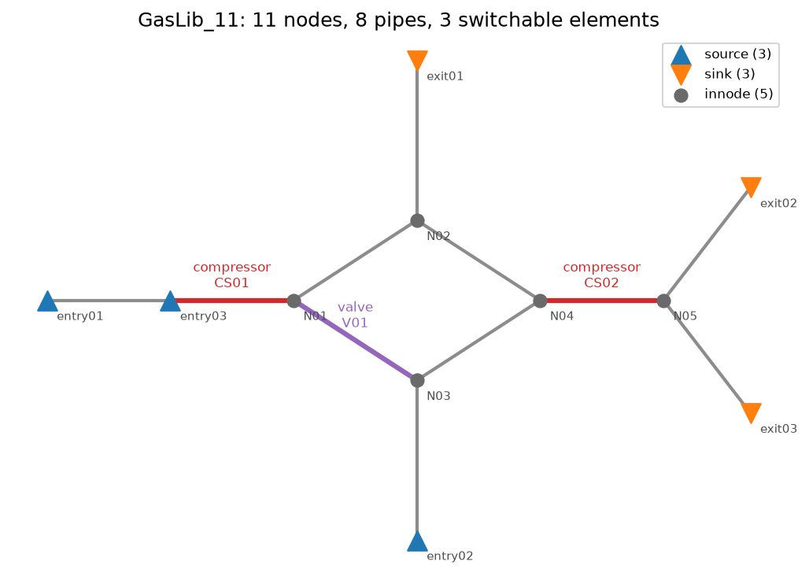
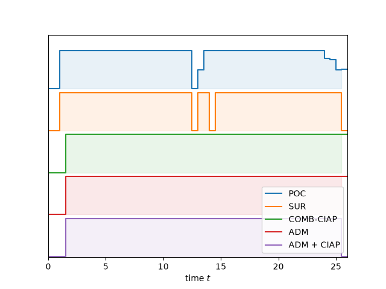
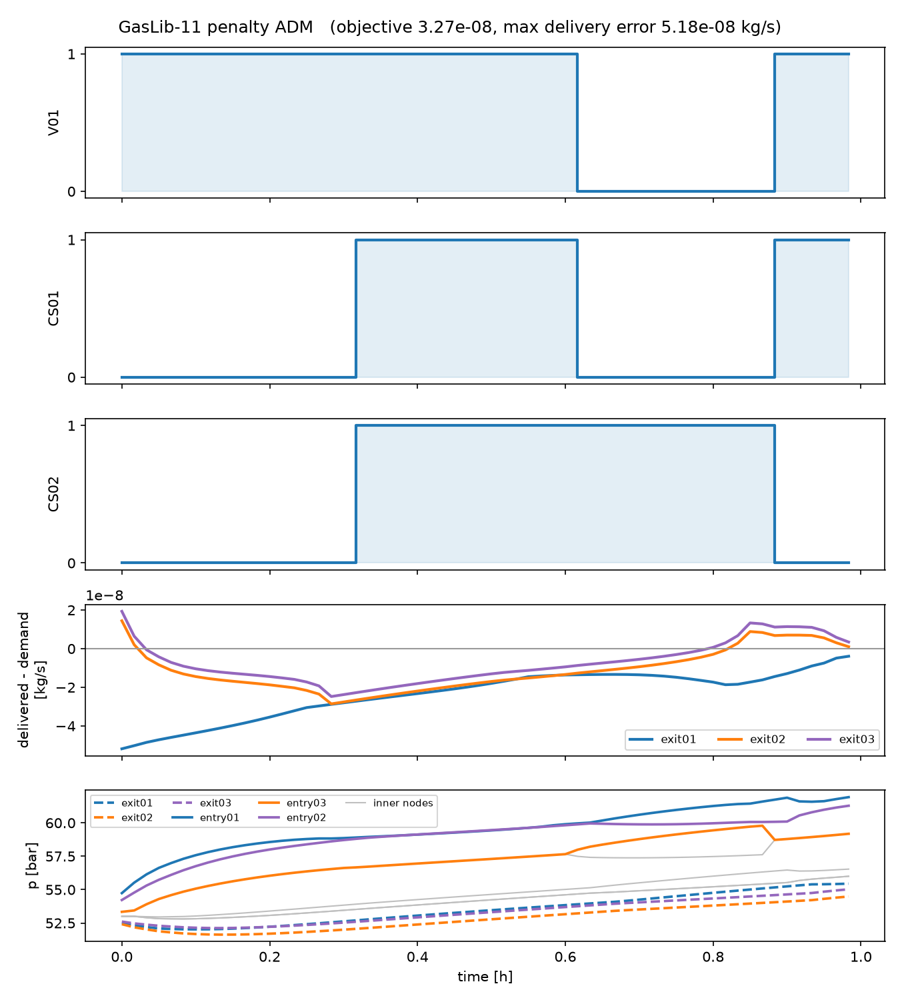

# gasnetopt — mixed-integer optimal control of energy networks

[](https://github.com/KeWu5678/gas-network-optimization/actions/workflows/ci.yml)

**Switching decisions with minimum dwell times on top of networked
dynamical systems.** Valves, compressor stations, or transmission lines are
switched on/off over time while a hyperbolic PDE network (gas flow,
telegraph equations) evolves underneath — and every switch must respect a
minimum up/down time, the same combinatorial structure as unit-commitment
scheduling. The package implements the decomposition algorithms of two
papers ([references](#references)) and applies them to two systems:

- **electric transmission lines** (telegraph equations; the benchmark of
  [1] and [2]), and
- **transient gas networks** (semilinear isothermal Euler equations) on
  [GasLib](https://gaslib.zib.de) instances with
  [TRR154 transient data](https://www.trr154.fau.de/transient-data/).



## The problem class

Minimize demand-tracking error over a horizon subject to

- **network dynamics**: 2×2 hyperbolic systems per edge (mass flow and
  pressure in characteristic variables), coupled at nodes by conservation
  laws — discretized by first-order upwind with implicit stiff friction
  (IMEX) under a CFL condition;
- **continuous controls**: boundary pressures / injections, compressor
  pressure increase;
- **binary controls**: the on/off state of each switchable element, with
  **minimum dwell-time constraints** that couple decisions across time and
  make the problem a mixed-integer optimal control problem (MIOCP) that
  direct MINLP solvers cannot crack at practical grid sizes.

## Method: relax → round → repair, coordinated by a penalty ADM

1. **Partial outer convexification (POC)** replaces the binary choice among
   the 2^s network configurations by convex multipliers α(t) with an SOS1
   constraint — a smooth NLP (CasADi/IPOPT). Its solution is fractional
   and serves as the reference the binary methods are measured against;
   the NLP is nonconvex, so the IPOPT solution is local and certifies no
   global bound (on the gas instance the ADM in fact finds a better local
   solution than the relaxation's).
2. **Combinatorial integral approximation (CIAP)** rounds α to a binary
   schedule: Sum-Up Rounding (fast, chatters), an exact MILP, or the
   dwell-time-constrained MILP (`COMB`).
3. **Penalty alternating direction method (ADM)** [2] alternates between
   the NLP (continuous side) and a small projection MILP (`tCOMB`,
   combinatorial side), coupled by an exact L1 penalty with increasing
   weight ρ — returning a binary, dwell-time-feasible schedule with
   reoptimized continuous controls.

Two robustness measures beyond the paper (both documented in
`docs/gas-network-design.md`):

- the ρ **homotopy is auto-scaled** to the model's objective magnitude
  (ρ_crit = Ψ_POC/(T·n_switches)); a fixed schedule can silently lock the
  iteration onto its initial reference when objective scales differ by
  orders of magnitude between models;
- the combinatorial reference is **initialized from the data** (projection
  of the rounded POC schedule), not from an arbitrary constant
  configuration.

| layer | tool |
|---|---|
| NLP (POC relaxation, reoptimization) | CasADi + IPOPT, sparse AD |
| MILP (CIAP, COMB, tCOMB) | solver-agnostic layer: HiGHS (default, via `scipy.optimize.milp`) or Gurobi (`gasnetopt[gurobi]`, warm starts) |
| model interface | typed `OCModel` — algorithms interact with any model only through `extract` / `overwrite` / `evaluate_objective` / grid `t` / encoding `r` |

## Results

### Transmission lines (benchmark of [2], extended-tree, coarse grid)

| method | objective | switching events | dwell-feasible |
|---|---|---|---|
| POC relaxation | 14.964 | – | no (fractional) |
| Sum-Up Rounding + reopt. | 15.257 | 31 | no |
| COMB-CIAP (dwell MILP) | 15.137 | 10 | yes |
| penalty ADM | 15.082 | 6 | yes |
| penalty ADM + CIAP | **15.077** | 9 | yes |

(regenerate with `examples/make_results_table.py`; seconds on a laptop)

SUR chatters — 31 switches, infeasible for any real dwell requirement. The
ADM variants deliver the best objectives **and** dwell-feasibility, within
0.8 % of the locally solved relaxation:



### Transient gas network (GasLib-11, TRR154 sinus scenario, 1 h, τ_min = 900 s)

The penalty ADM turns the fractional POC relaxation (local solution,
objective 1.1·10⁻⁵) into a binary, dwell-feasible schedule at objective
3.3·10⁻⁸ with **zero delivery error** and all pressures within the
40–70 bar bounds — in ~2 minutes end-to-end on open-source solvers
(IPOPT + HiGHS). Sum-Up Rounding tracks the demand only by chattering:
**102 switching events** across the three elements (the compressors flip
at ~50 % duty) against the ADM's **7** — 93 % fewer switching actions at
~180× lower objective:



(The short blocks at the very end of the horizon are the end-of-horizon
convention: terminal blocks are exempt from the min-up check, as in
real-world transient gas control models.) Measured performance caveat:
on the finer 2 h grid (Δt = 60 s, 960 binaries per projection MILP) the
tCOMB solves exceed 1.5 h total on HiGHS — that grid needs the Gurobi
backend (`--milp-backend gurobi`) or a `time_budget`.

## Engineering

The optimizer is built to *propose a schedule under operational
constraints*, borrowing the structural signatures of production grid
optimization:

- **Never return nothing**: `miocp_adm(time_budget=...)` keeps a binary,
  dwell-feasible incumbent from the first projection on and returns it
  (with reoptimized continuous controls) when the wall-clock budget runs
  out. The budget is soft — checked between solver calls, with NLP solves
  additionally capped by an IPOPT wall-time limit and MILP solves by
  per-call `time_limit`s that return incumbents; it assumes the budget
  admits one relaxation solve, one projection and one reoptimization.
  The returned point's constraint residuals are verified — a failed final
  solve raises instead of reporting an unverified objective.
- **Data validation as its own layer**: `gaslib_io.validate(net, bc)`
  diagnoses dirty data by name (missing bounds that would poison the NLP
  with 0·∞ = NaN, sinks without boundary data, disconnected nodes, demand
  exceeding supply capacity) before any solver runs.
- **Determinism**: single-threaded solver settings, seeded tests, locked
  dependencies (`uv.lock`), and a Docker image (pinned base images) that
  reproduces the experiments in the locked environment.
- **Quality gates in CI**: pytest (the gas code path is covered by a
  synthetic network fixture, so CI needs no third-party data), ruff, and
  mypy on every push.

## Repository layout

```
data/
  translines/        demand profiles (tracked; the only data needed for CI)
  gaslib/            GasLib-11/-40 + TRR154 .bcd/.state (local, see Data)
docs/
  gas-network-design.md   model derivation & design decisions
  references/             papers (local, not redistributed)
examples/            runnable scripts: benchmarks, figures, results table
src/gasnetopt/
  collocation.py     OCModel base (typed interface), collocation utilities
  milp.py            solver-agnostic MILP layer (HiGHS/Gurobi, time limits)
  ciap.py            sum-up rounding, CIAP-MILP, dwell-time COMB
  adm.py             penalty ADM, tCOMB projection, time-budget fallback
  gas/               GasLib/TRR154 parsers + validation, ISO2 gas model
  translines/        telegraph-equation benchmark
tests/               pytest suite incl. synthetic gas fixture
```

## Quickstart

Requires [uv](https://docs.astral.sh/uv/):

```sh
uv sync                      # locked environment (casadi/ipopt, numpy, scipy)
uv run pytest                # 22 tests; gas benchmark tests skip without data

# transmission lines: POC + SUR (runs from the repo alone)
uv run python examples/run_translines.py

# full method benchmark + paper-style figures + results table
uv run python examples/run_translines_adm.py --net "extended tree" --coarse
uv run python examples/make_results_table.py \
    results/translines/translines_extended_tree_results

# gas network (needs GasLib data, see Data below)
uv run python examples/run_gaslib11.py --tau-min 900
```

Or via Docker (same locked environment):

```sh
docker build -t gasnetopt .
docker run --rm gasnetopt                       # test suite
docker run --rm -v "$PWD/results:/app/results" gasnetopt \
    uv run python examples/run_translines.py
```

## Data

The transmission-lines demand profiles ship with the repository. GasLib
networks (CC-BY 3.0) and TRR154 transient data are **not redistributed**:
download [GasLib-11](https://gaslib.zib.de) and the matching
[TRR154 `.bcd`](https://www.trr154.fau.de/transient-data/) into
`data/gaslib/GasLib-11/` (paths in `examples/run_gaslib11.py`). CI covers
the gas code path with the synthetic fixture in `tests/fixtures/` instead.

## Limitations & extensions

- Deterministic demand; scenario-based (stochastic) demand is the natural
  extension of the tracking objective.
- Dwell times act per network configuration — by design, matching the
  methodology and real-world operation-mode switching; the analysis and
  literature trail is in `docs/gas-network-design.md`.
- GasLib-40 (64 configurations) parses and builds; scaling the ADM there
  needs a sparse switch encoding instead of full enumeration.

## References

1. S. Göttlich, A. Potschka, C. Teuber: *A partial outer convexification
   approach to control transmission lines*, Comput. Optim. Appl. (2019).
2. S. Göttlich, F. M. Hante, A. Potschka, L. Schewe: *Penalty alternating
   direction methods for mixed-integer optimal control with combinatorial
   constraints*, Math. Program. 188 (2021) 599–619.
3. P. Domschke, B. Hiller, J. Lang, C. Tischendorf: *Modellierung von
   Gasnetzwerken: Eine Übersicht*, TRR154 preprint 2717 (2017).

## License & credits

GPL-3.0-or-later. The transmission-lines core is based on code
Copyright 2018 A. Potschka, C. Teuber (GPL-3.0-or-later); the gas-network
extension, the solver-agnostic MILP layer, the ADM robustness measures and
the engineering around them are this repository's contribution. GasLib
data: CC-BY 3.0 (cite Schmidt et al., *GasLib — A Library of Gas Network
Instances*, Data 2(4):40, 2017).
